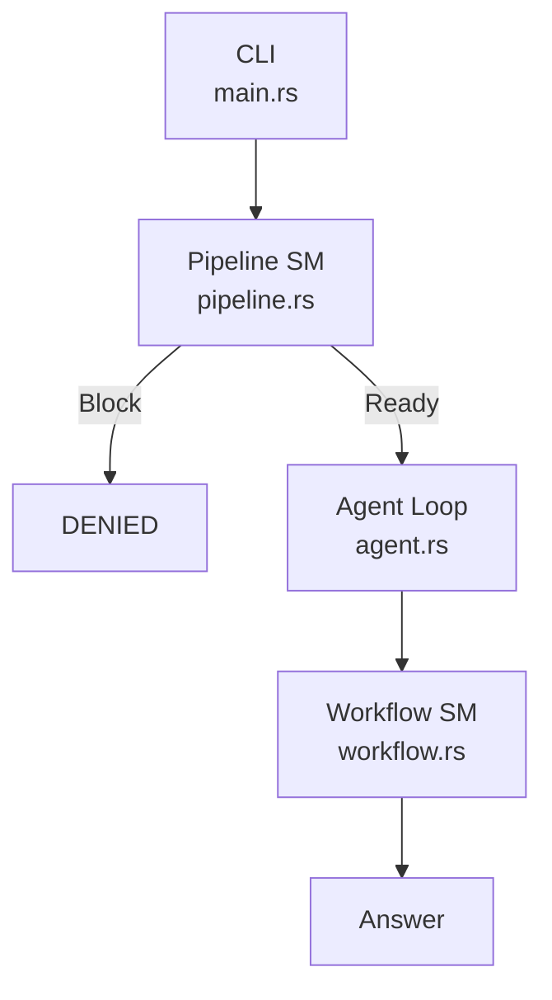
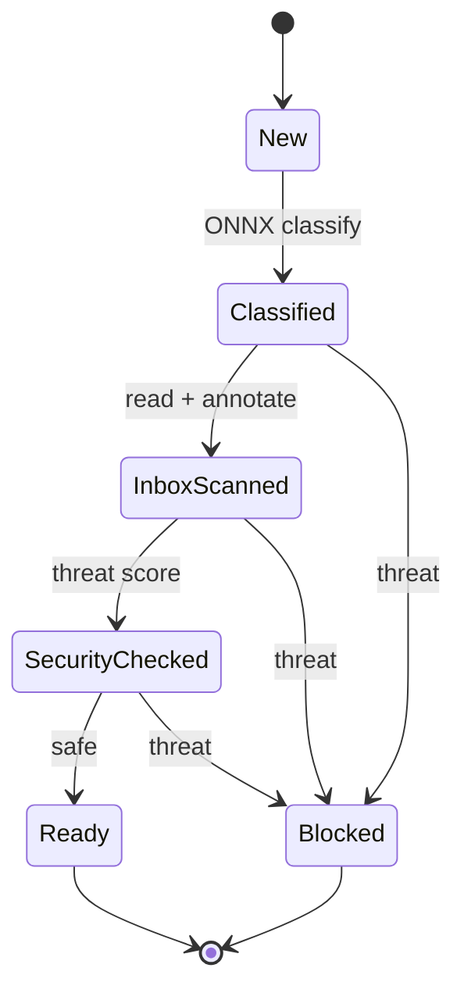
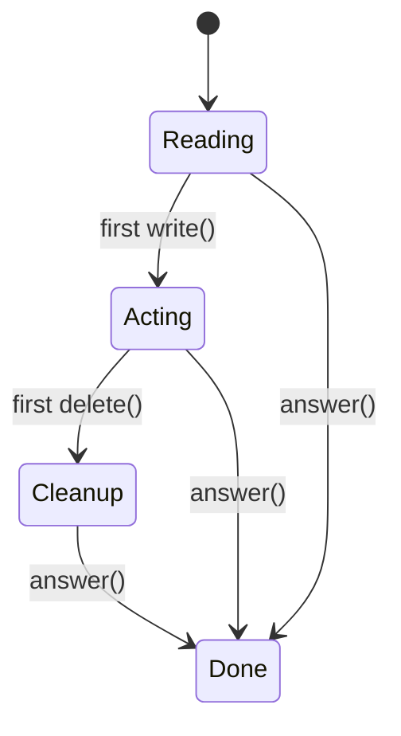
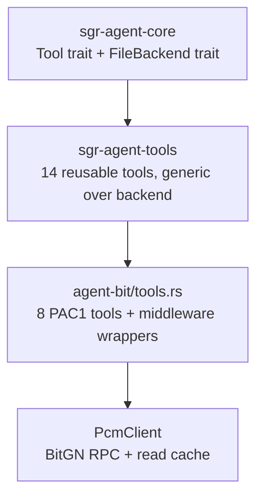
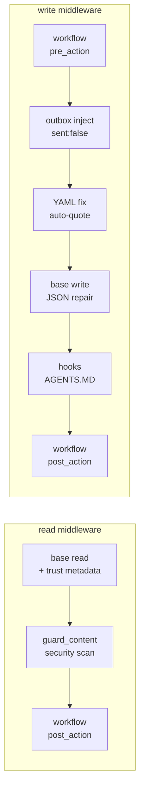
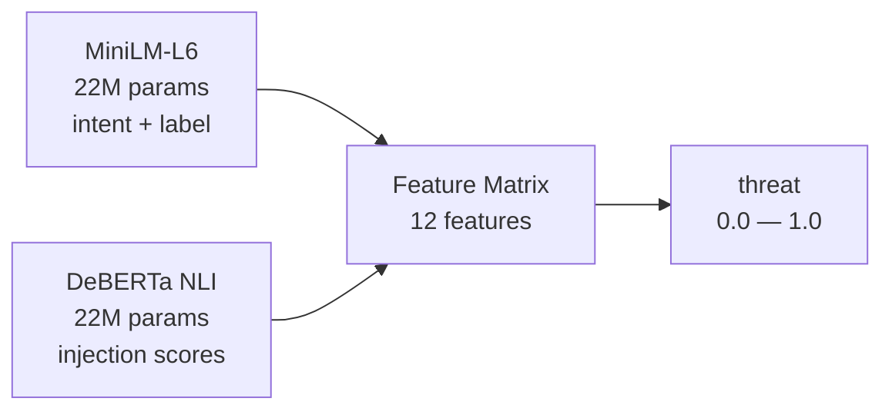

# How I spent $250+ on an AI agent competition and what I learned

I scored 17 out of 104. Let me tell you how I got there and why I'm actually happy about it.

## The setup

[BitGN PAC1](https://bitgn.com/challenge/PAC) is an agent benchmark. Your AI agent connects via API to a virtual workspace -- emails, invoices, contacts, OTP verifications, social engineering attacks -- and completes tasks. 104 tasks, scored automatically. No hand-holding.

I also organized a [physical hub event in Gazipasa](https://bitgn.com/h/hub-Tuz3bqmpZPuaFfVU) for it. 14 hours. The competition started, and I found myself simultaneously explaining to people what agents are, how the competition works, and -- with one hand -- frantically throwing submissions at the leaderboard while begging Claude to figure things out.

Not the ideal competitive setup.

## The money pit

Before the competition, I spent about $50 testing models. I ran through 30+ different models across 6 providers. The best performer? **Nemotron 120B** -- a free model via Cloudflare Workers AI. Seed-2.0-pro was decent too.

Then the competition started, and I switched to GPT-5.4. One run: **$50**. I did three. That's $150 in two hours of panic.

After the competition, another $50 on weekend debugging sessions. Total damage: north of $250.

## My over-engineered stack

I built everything in Rust, from my own libraries. Three layers:

1. **[openai-oxide](https://github.com/fortunto2/openai-oxide)** -- OpenAI client with caching, websockets, realtime. I like everything about this layer.
2. **[sgr-agent](https://github.com/fortunto2/rust-code/tree/master/crates/sgr-agent)** -- Agent core with [SGR patterns](https://abdullin.com/schema-guided-reasoning/) from Rinat (thanks to him for both the competition and the ideas -- I studied the [Python reference implementation](https://github.com/vamplabAI/sgr-agent-core)).
3. **[agent-bit](https://github.com/fortunto2/agent-bit)** -- The competition agent itself.

What I built into the architecture:

- ONNX classifier (MiniLM-L6) for intent and security labels -- runs before the LLM even sees the task
- 12-feature threat matrix, NLI DeBERTa for injection detection, trust graph, two state machines
- 15 hot-reloadable skills, hooks, and tools
- Agent loop -- SGR + function calling hybrid
- OutcomeValidator with adaptive kNN on the output side

Was this over-engineered for a 2-hour competition? Absolutely. But this is the [[agent-mistake-fix-harness]] philosophy in action -- every mistake becomes a permanent fix in the framework.

## Architecture deep dive

Here's how the layers connect:



**Pipeline SM** ([pipeline.rs](https://github.com/fortunto2/agent-bit/blob/main/src/pipeline.rs)) — deterministic, no LLM, blocks threats before they reach the model:



**Workflow SM** ([workflow.rs](https://github.com/fortunto2/agent-bit/blob/main/src/workflow.rs)) — runs during agent loop, nudges the agent back on track:



### Two state machines

The system has two separate state machines that serve very different purposes.

**Pipeline SM** ([pipeline.rs](https://github.com/fortunto2/agent-bit/blob/main/src/pipeline.rs)) runs *before* the LLM. It's completely deterministic -- pure functions that consume the current state and return the next. The compiler enforces that you can't skip stages or access data from a stage that hasn't run:

```rust
// Each state owns its data. Transitions consume self → return next.
pub struct New { pub instruction: String }

pub struct Classified {
    pub instruction: String,
    pub intent: String,              // intent_inbox, intent_delete, ...
    pub intent_confidence: f32,
    pub instruction_label: String,   // crm, injection, credential, ...
}

pub struct InboxScanned {
    pub inbox_files: Vec<InboxFile>,  // content + SecurityAssessment each
    pub crm_graph: CrmGraph,          // petgraph (empty now — lookup_contact on demand)
}

// Pipeline short-circuits at any stage:
pub struct BlockReason {
    pub outcome: &'static str,    // "DENIED", "CLARIFICATION"
    pub message: String,
    pub stage: &'static str,      // which stage blocked
}
```

**Workflow SM** ([workflow.rs](https://github.com/fortunto2/agent-bit/blob/main/src/workflow.rs)) runs *during* the agent loop. It tracks what the agent is doing and intervenes when things go wrong:

```rust
pub enum Phase { Reading, Acting, Cleanup, Done }

pub struct WorkflowState {
    phase: Phase,
    read_paths: Vec<String>,
    write_paths: Vec<String>,
    reads_since_write: usize,       // detect read-loops
    verification_only: bool,         // OTP oracle: zero mutations
    outbox_limit: usize,            // prevent over-processing
    hooks: SharedHookRegistry,       // AGENTS.MD parsed hooks
}
```

Every tool call passes through the workflow: `pre_action()` can block it, `post_action()` can inject follow-up messages. This is how the agent gets nudged back on track without extra LLM calls.

### Tools: three crates, two loading modes

This is where the weekend rebuild made the biggest difference. Tools are split across three Rust crates:



**[sgr-agent-core](https://github.com/fortunto2/rust-code/tree/master/crates/sgr-agent-core)** defines the traits. **[sgr-agent-tools](https://github.com/fortunto2/rust-code/tree/master/crates/sgr-agent-tools)** implements them generically -- same tool code works with any `FileBackend`: PcmClient (competition RPC), LocalFs (CLI agents), or MockFs (tests). **[agent-bit/tools.rs](https://github.com/fortunto2/agent-bit/blob/main/src/tools.rs)** wraps them with PAC1-specific middleware (security scanning, workflow guards, AGENTS.MD hooks).

#### All tools

**[sgr-agent-tools](https://github.com/fortunto2/rust-code/tree/master/crates/sgr-agent-tools)** -- 14 reusable tools, generic over `FileBackend`:

| Tool | Loading | What it does |
|------|---------|-------------|
| `read` | always | Read file with [trust metadata](https://github.com/fortunto2/rust-code/blob/master/crates/sgr-agent-tools/src/trust.rs) (`[path \| trusted/untrusted]`). Two modes: line slice and indentation expand |
| `write` | always | Write file with [JSON auto-repair](https://github.com/fortunto2/rust-code/blob/master/crates/sgr-agent-tools/src/write.rs) via llm_json. Supports ranged overwrite (start_line/end_line) |
| `delete` | always | Batch delete (single path or paths array) |
| `search` | always | [Smart search](https://github.com/fortunto2/rust-code/blob/master/crates/sgr-agent-tools/src/search.rs): exact → name variants → fuzzy regex → Levenshtein on filenames. Auto-expands full content when <=10 files match |
| `list` | always | Directory listing |
| `tree` | always | Directory tree with depth limit |
| `read_all` | always | **The game-changer.** [Batch read entire directory](https://github.com/fortunto2/rust-code/blob/master/crates/sgr-agent-tools/src/read_all.rs) in one call. Turned 15 sequential reads into 1 tool call. Steps: 185 → 43 |
| `update_plan` | always | Task checklist persisted to plan.md. `[x]` / `[~]` / `[ ]` format |
| `eval` | feature `eval` | [JavaScript runtime](https://github.com/fortunto2/rust-code/blob/master/crates/sgr-agent-tools/src/eval.rs) via Boa engine. Pre-reads files by glob pattern, exposes as `file_0..file_N`. Dynamic calculations |
| `shell` | feature `shell` | Execute commands with timeout (2 min default, 10 min max). 100KB output cap |
| `apply_patch` | feature `patch` | [Codex-compatible diff DSL](https://github.com/fortunto2/rust-code/blob/master/crates/sgr-agent-tools/src/apply_patch.rs). Saves tokens vs full write for small edits |
| `mkdir` | deferred | Create directory (LLM loads when needed) |
| `move` | deferred | Move/rename file |
| `find` | deferred | Find files by pattern and type |

**[agent-bit/tools.rs](https://github.com/fortunto2/agent-bit/blob/main/src/tools.rs)** -- 8 PAC1-specific tools (+ middleware wrappers over base read/write/delete/search):

| Tool | What it does |
|------|-------------|
| `answer` | Submit final answer with outcome (OK/DENIED/CLARIFICATION/UNSUPPORTED). [OutcomeValidator](https://github.com/fortunto2/agent-bit/blob/main/src/classifier.rs) checks answer via kNN embeddings before submitting |
| `context` | Get workspace date/time from harness |
| `search_and_read` | Search + read first match in one call (saves a round-trip) |
| `date_calc` | Date arithmetic: diff_days, add_days, next_birthday, compare, format. Uses chrono |
| `grep_count` | Count matching lines -- for "how many" questions without reading all content |
| `lookup_contact` | On-demand CRM lookup by name/email. Replaced pre-loaded CRM graph (saved 25 RPCs at startup) |
| `list_skills` | Show available skills (re-exported from sgr-agent) |
| `get_skill` | Read a specific skill body (re-exported from sgr-agent) |

#### Middleware pattern

Agent-bit doesn't rewrite tools -- it wraps them. Each wrapper adds a middleware chain:



```rust
// agent-bit wraps sgr-agent-tools with domain middleware:
pub struct ReadTool {
    inner: sgr_agent_tools::ReadTool<PcmClient>,  // base tool
    workflow: SharedWorkflowState,                  // phase tracking
}
// execute: inner.read() → guard_content() → workflow.post_action()
```

#### Why this split matters

Before the split, all tool logic was in agent-bit (1500+ lines). Now:
- **sgr-agent-tools** (crates.io) -- reusable in any Rust agent. Zero PAC1 knowledge
- **agent-bit/tools.rs** -- only domain middleware (security, workflow, hooks)

New agent project? `cargo add sgr-agent-tools` and you get read, write, search, eval, apply_patch -- all with JSON repair, trust metadata, smart search cascade. Add your own middleware on top.

### Skills: hot-reloadable domain knowledge

15 markdown files with YAML frontmatter. The classifier picks the right one based on ML intent + keywords:

```yaml
# skills/inbox-processing/SKILL.md
---
name: inbox-processing
triggers: [intent_inbox]
priority: 15
keywords: [inbox, queue, pending, process, review]
---

WORKFLOW (minimize steps):
  1. Inbox messages already in context. Do NOT re-read.
  2. Read channel files: docs/channels/*.txt
  3. For EACH message: check channel trust, evaluate action
  ...
```

Selection logic handles a subtle bug I hit: when the ML classifier labeled a cleanup task as "injection" (false positive), the security skill hijacked the workflow and returned DENIED instead of deleting files. Fix: benign labels check intent first, security labels check security first.

```rust
// skills.rs — selection with hijack prevention
if is_security_label {
    // Security label → security skill first, intent as fallback
    registry.select(&[security_label, intent], instruction)
} else {
    // Benign label → intent first (prevents hijacking)
    registry.select(&[intent], instruction)
}
```

Skills are loaded from disk first (hot-reload -- change markdown, agent picks it up next run) with compiled-in fallback via `include_str!` for deployment without disk dependency.

### Local ML: ONNX classifiers

Two ONNX models run locally before the LLM sees anything. Zero API cost, <10ms inference:



Both models run locally via ONNX Runtime. <10ms inference, zero API cost. The 12 features include ML confidence, structural injection score, sender trust, domain match, NLI scores, channel trust, and more. Everything feeds into `sigmoid(weighted_sum)` -- a single number that the pipeline uses to block or pass.

Plus an `OutcomeValidator` on the output side -- adaptive kNN over ONNX embeddings of the agent's answer, compared to prototype outcome descriptions. Catches when the agent says "DENIED" for a legitimate task or "OK" for a blocked one.

### Hooks: AGENTS.MD parser

The competition workspace has an `AGENTS.MD` file with rules like *"When adding a card under /cards/, also update threads under /threads/."* The hooks system parses these into structured rules:

```rust
struct Hook {
    tool: String,           // "write"
    path_contains: String,  // "cards/"
    message: String,        // "NEXT: update matching thread in threads/"
}
```

Every `write()` and `delete()` call checks the hook registry and injects follow-up instructions into the tool output. The agent sees them as part of the response and acts accordingly -- no extra LLM call needed.

## What other participants did

After the competition, I looked at what the top scorers actually built. Different universe.

[inozemtsev/bitgn](https://github.com/inozemtsev/bitgn), [ai-babai/bitgn-env](https://github.com/ai-babai/bitgn-env) -- they took [Codex CLI](https://github.com/openai/codex) with a simple wrapper and agent instructions file. No custom frameworks. No ONNX classifiers. No state machines. 70-80 points.

Sometimes the best architecture is no architecture.

(By the way, Codex has an [official Rust version](https://github.com/openai/codex/tree/main/codex-rs) now. I found it later, and it helped me understand how to design tools better.)

## What went wrong

### 1. Dev-Prod gap

On development tasks (43 total), I got **41/43 on Nemotron** -- a free model! In production (104 tasks), everything fell apart. I had hardcoded too many rules at the pre-LLM layer. While updating them in a real-time loop during the competition... well, you can imagine.

### 2. Dumb tools, too many steps

My agent was doing 185 steps per run. Average time: 229 seconds per task. Sum of trial times: 396 minutes. The problem: no batch tools. Every file read was a separate LLM round-trip.

### 3. Blind flying

I couldn't see step counts or cost per run clearly. The leaderboard only appeared on Saturday. I was flying blind during the actual competition.

## The weekend rebuild

I sat down on Saturday and Sunday and actually fixed things.

**Tools:** Created `ReadAllTool` -- read an entire directory in one pass instead of 15 separate calls. Added `EvalTool` -- run JavaScript dynamically via the Boa engine (also works with bash for local scripts). Extracted a [shared tools package](https://github.com/fortunto2/rust-code/tree/master/crates/sgr-agent-tools/src).

**Observability:** Set up [Phoenix](https://phoenix.arize.com/) locally with OpenTelemetry. My sgr-agent had basic tracing, but I made it proper -- every tool call, every LLM round-trip, every token count visible.

**Results after the rebuild** (numbers still improving -- this is a snapshot, not the ceiling):

| Metric | Competition (Apr 11) | After rebuild (Apr 13) | Delta |
|--------|---------------------|----------------------|-------|
| Model | GPT-5.4 | GPT-5.4 | same |
| Parallelism | -104 | 104 | same |
| Score | [17/104 → 16.3%](https://eu.bitgn.com/runs/run-22J8DDkgwCuT9GeGCXRk8WPHw) | **74/104 → 71.2%** | **+4.4x** |
| Sum trial times | 396 min (23,806s) | **155 min (9,326s)** | **-61%** |
| Avg time/task | 229s | **90s** | **-61%** |
| Avg steps/task | 185.8 | **43.6** | **-76%** |
| Fastest task | 97s | **4s** | |
| Slowest task | 508s | **222s** | |

All 104 tasks run in parallel. Total wall-clock time: 3-4 minutes.

## Lessons

**1. Ship simple first, optimize later.** Codex CLI + good prompts = 70-80 points. My entire Rust pipeline = 17 points on competition day. The infrastructure I built is better *now*, but it wasn't ready *then*.

**2. Batch tools are not optional.** `ReadAllTool` alone cut steps from 185 to 43. Each tool call = one LLM round-trip = 2-5 seconds. Multiply by 100+ tasks.

**3. Observability from day one.** I couldn't debug what I couldn't see. Phoenix + OTEL should have been there from the start, not bolted on after the disaster.

**4. The dev-prod gap will get you.** 41/43 in dev means nothing if prod has 2.5x more tasks with different patterns. Hardcoded rules are technical debt with compound interest.

**5. Architecture pays off -- eventually.** My framework now powers multiple agents I'm building. The competition was an expensive stress test, but the sgr-agent ecosystem is stronger for it. A $250 tuition fee for a reusable agent core. This is the [[portfolio-approach]] -- each project strengthens the next.

## Am I happy?

Yes. 17/104 during the competition was embarrassing. 74/104 after the weekend rebuild -- and still improving -- is a real system. The architecture is solid, the tools are smart, and every agent I build from here starts at a higher baseline.

The competition was chaos. The learning was worth every dollar.

---

*Links: [agent-bit on GitHub](https://github.com/fortunto2/agent-bit) | [PAC1 Challenge](https://bitgn.com/challenge/PAC) | [Telegram post](https://t.me/life2film/601)*

*See also:*
- *[[agent-bit-pac1]] -- technical architecture deep-dive (SGR pipeline, tools, FileBackend trait)*
- *[[schema-guided-reasoning]] -- the SGR pattern that powers the agent loop*
- *[[agent-benchmarks]] -- how PAC1 compares to SWE-bench, PinchBench, and others*
- *[[cli-first-testing]] -- why every project gets a CLI mirror*
- *[[project-openai-oxide]] -- the OpenAI Rust client underneath*
