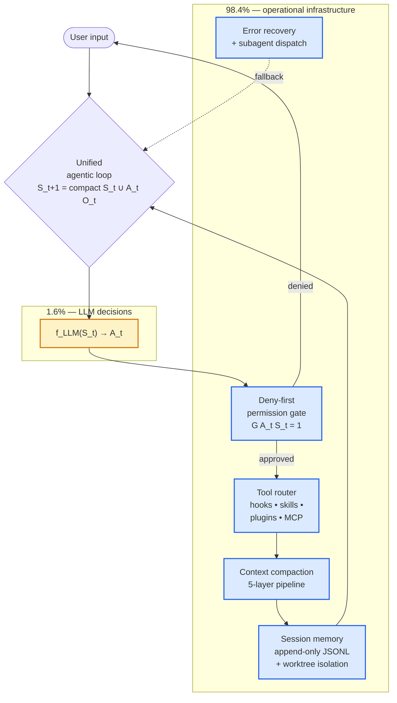

## Key Takeaways

Liu et al. (VILA-Lab, April 2026) reverse-engineered Claude Code v2.1.88 and counted the bytes. **Only 1.6% of the TypeScript codebase is LLM decision logic. The other 98.4% is operational infrastructure** — context compaction, tool routing, permissions, session persistence, error recovery. This is the first empirical measurement of the [[harness-engineering-summary|harness engineering]] thesis: as base model capabilities converge, the moat moves from prompting tricks to deterministic scaffolding around the model.

The system funnels every interaction — slash commands, hooks, MCP calls, subagent spawns — into a **single unified agentic loop** formalized as `S_{t+1} = compact(S_t ∪ {A_t, O_t})`, where `A_t = f_LLM(S_t)`. Seven components separate reasoning from execution. The LM is trusted to make local decisions; the harness enforces global safety, memory, and recovery.

## Architecture map

The loop itself is trivial; the gravity is in the five boxes around it.

## The five-layer context compaction pipeline

Bounded token windows are managed by a lazy-degradation ladder — cheapest operation first:

1. **Budget reduction** — swap oversized raw outputs for reference pointers
2. **Snip** — trim older, less relevant history
3. **Microcompact** — fine-grained, cache-aware compression to preserve prompt caching economics
4. **Context collapse** — read-time projection that merges messages visually without deleting
5. **Auto-compact** — invoke the model itself to summarize state

This sequential graduation maximizes working memory while minimizing cache invalidation. It is [[context-engineering|context engineering]] operationalized — not a single `CLAUDE.md` file, but a whole compression economy.

## Deny-first permissions and the 93% problem

Authorization runs on **deny-first** logic: explicit declarative rules → trust mode (strict planning → auto-execution) → optional ML classifier for intent safety. Action executes only if `G(A_t, S_t) = 1`. Permissions are deliberately **not serialized across session resumption** — safety-critical state is ephemeral by design.

The paper's uncomfortable finding: **~93% of permission prompts are approved by users.** The gate exists but approval fatigue compromises it. Deterministic guardrails solve the machine-side problem but create a [[agent-self-discipline|human discipline]] problem. Any serious harness design has to account for this — more prompts ≠ more safety once fatigue saturates.

## Extension mechanisms ranked by token cost

The paper maps four extension tiers by their default context footprint — matching our own [[agent-patterns-stream2|lazy-load vs eager-load]] observation:

- **Hooks** — zero default context (fire on event, bring nothing into the prompt)
- **Skills** — minimal instruction sets (lazy-load on trigger)
- **Plugins** — medium-cost packaging
- **MCP servers** — high token budget due to complex schemas (eager-load on connect)

Implication: 150 skills is fine. 10 MCPs and the context is already half-full before the agent does any work.

## Architectural contrast

| System | Safety approach | Execution model |
|--------|----------------|-----------------|
| Claude Code | Deny-first permissions + worktree isolation | Single Unix-like agentic loop, minimal invasive |
| SWE-Agent / OpenHands | Heavy Docker containerization | Isolated execution environment |
| LangGraph | Typed state graph with nodes and edges | Constrain cognitive paths |
| Aider | Git as safety net (rollback) | VCS-centric |

Claude Code's bet: trust the model's local reasoning, constrain only *execution*. This is the opposite of LangGraph-style cognitive scaffolding. The richer the model, the more the answer moves from "shape the thoughts" to "shape the environment."

## Validated on our own stack

We hit the same 98.4/1.6 ratio independently building [[agent-bit-pac1|Agent-Bit for PAC1]]. Our Rust `sgr-agent` framework scored 93% on BitGN with **Nemotron 120B (free)** — beating GPT-5.4 ($54/day, 77%) — because the architecture carries the weight, not the model:

- **Pipeline state machine before the LLM** (classify → scan inbox → security check → ready) blocks 100% of obvious threats with zero tokens. Mirrors Claude Code's deny-first gate, just earlier in the loop
- **Trust metadata on `read()`** (`[path | trusted/untrusted]`) is the micro-equivalent of the deny-first permission model — annotation gives the LLM a safety hint without blocking reasoning
- **10 active + 5 deferred tools** matches the paper's hook/skill/plugin/MCP tiering: heavy schemas stay out of context until invoked
- **FileBackend trait** = Unix-like abstraction: same agent code runs against RPC (PAC1), local FS, or mock. Same "constrain execution, trust reasoning" bet Claude Code makes

Empirical parallel: paper says 98.4% infra / 1.6% AI logic. Our experience says architecture ≈ 80% of outcome, model ≈ 20%. Same direction, same moat.

## Structural trade-offs

The paper doesn't only celebrate. It names the costs:

- **+40.7% code complexity** in projects heavily assisted by agent tooling (external studies cited) — agents optimize for task completion, not global coherence
- **Subagent isolation** means optimal *local* decisions without full global codebase awareness. Lossy compression accelerates this
- **Human mastery atrophy** — "developer's neural connectivity and codebase comprehension demonstrably atrophy" with sustained delegation
- **Approval fatigue** (see above) — automated safety gates erode human oversight over time

The architectural tension: **immediate capability amplification vs long-term preservation of codebase coherence and human mastery.** Harness design has to make a deliberate bet on this axis, not just maximize task throughput.

## Connections

- [[harness-engineering-summary]] — the thesis this paper validates empirically. Now we have a number: 98.4%
- [[context-engineering]] — the five-layer compaction is a concrete implementation of "context as code, not chat history"
- [[writing-claude-md]] — CLAUDE.md is the root node of the seven-component architecture; this paper shows what sits behind it
- [[agent-toolkit-landscape]] — paper explicitly frames Claude Code against LangGraph, SWE-Agent, OpenHands, Aider. Different safety bets
- [[agent-patterns-stream2]] — the hook/skill/plugin/MCP tiering by token cost matches the lazy-load/eager-load observation
- [[agent-self-discipline]] — 93% approval = the human drift problem; deterministic gates do not solve discipline
- [[agent-sandboxing]] — worktree isolation + deny-first is the execution-level equivalent of VM sandboxing
- [[agent-mistake-fix-harness]] — fixing the harness when an agent fails assumes the harness is 98.4% of the system. Now measured
- [[decision-traces-compound]] — append-only JSONL transcripts are the memory substrate for trace-based learning
- [[agent-bit-pac1]] — our independent validation: 93% on PAC1 with Nemotron 120B (free) because the Rust harness does 80% of the work. Same deny-first + tool tiering + Unix-like backend abstraction
- [[pac1-competition-retrospective]] — competition retrospective: architecture beats model — same lesson the Claude Code paper measures
- [[fff-agent-file-search]] — Kovalenko's retrieval-layer thesis: compaction wipes the agent's working set, so the tool (not the model) has to carry frecency/combo/git context

## References

- Liu, Zhao, Shang, Shen — *Dive into Claude Code: The Design Space of Today's and Future AI Agent Systems* (arXiv:2604.14228)
- GitHub: `VILA-Lab/Dive-into-Claude-Code`
- Review: arxiviq.substack.com/p/dive-into-claude-code-the-design
- Target: Claude Code v2.1.88 (TypeScript source)
